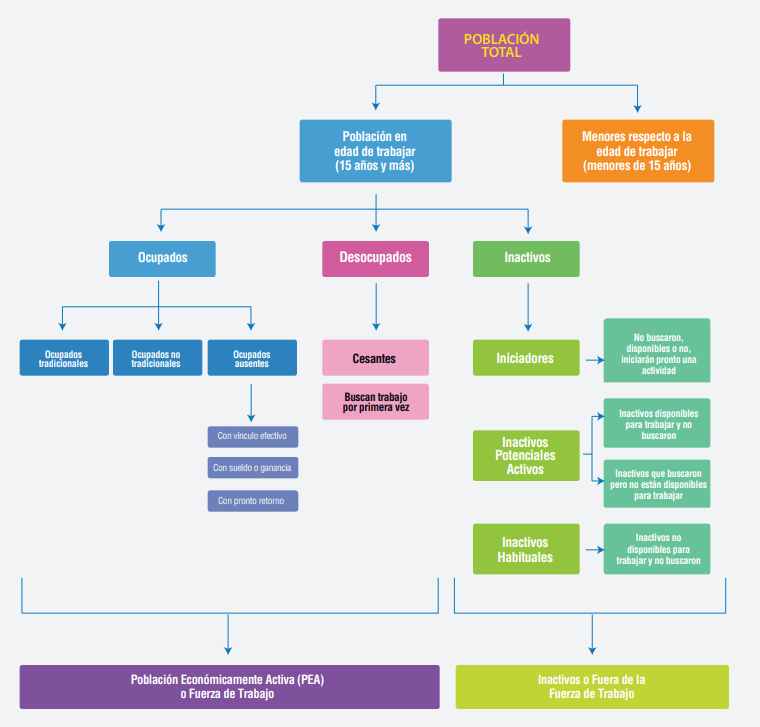
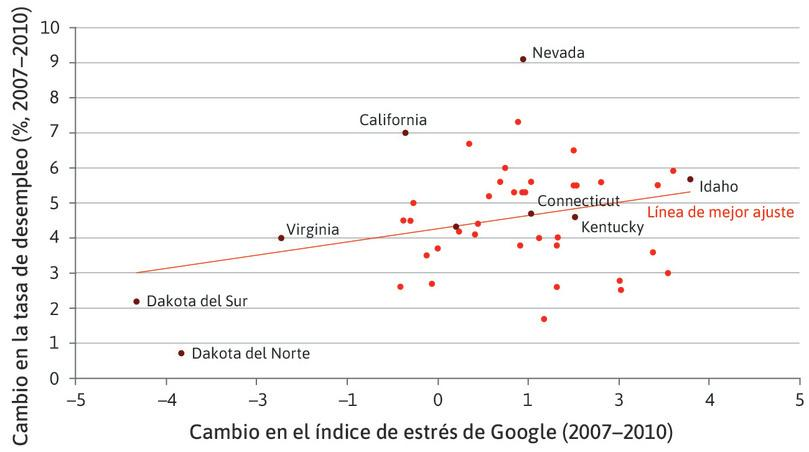
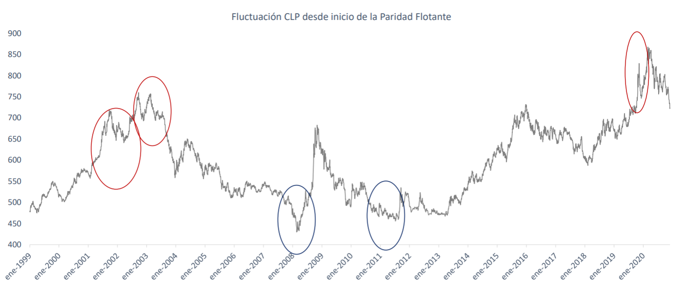
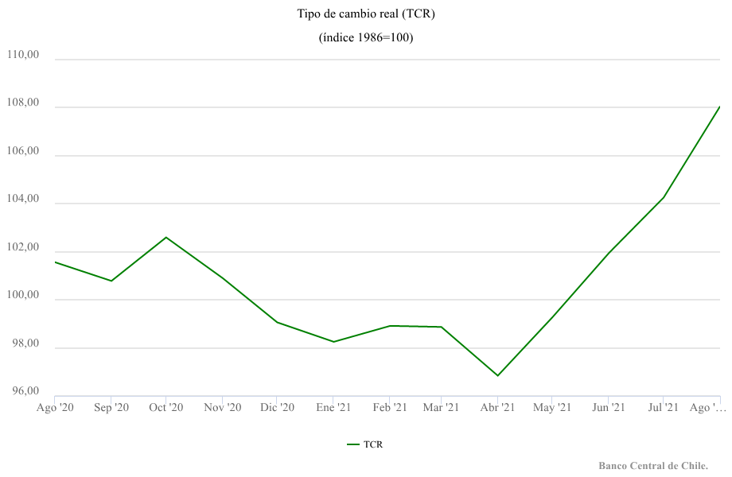

# Presentación del curso

## Equipo docente

**Docentes:**

- Sebastián Egaña Santibáñez
- Felipe Jaque

**Ayudante:**

- Jean Pierre Bravo

------------------------------------------------------------------------

## Contenidos del curso

- Análisis de principales variables macroeconómicas
- Políticas macroeconómicas
- Revisión de modelos de mercado de bienes y de activos financieros
- Comportamiento de los agentes económicos: consumo y gobierno

------------------------------------------------------------------------

## Sobre el docente

**Sebastián Egaña Santibáñez**

- Data Tech Lead & Analytics Translator — LATAM Airlines
- Correo: [segana@fen.uchile.cl](mailto:segana@fen.uchile.cl)
- Web: <https://segana.netlify.app>
- LinkedIn: [enlace](https://www.linkedin.com/in/sebastian-egana-santibanez/)

------------------------------------------------------------------------

## Hilo conductor de la clase

Partimos con un titular. Al terminar la sesión deberían poder leerlo con precisión.

::: {style="font-size: 1.15em; font-weight: bold; color: #0d6e6e; border-left: 6px solid #0d6e6e; padding-left: 1em; margin: 1em 0;"}
"US inflation tripled last month on record spike in gas prices"
:::

::: {style="font-size: 0.8em; color: #666;"}
— CNN Business, 10 de abril de 2026
:::

Para entenderlo necesitamos saber qué mide el IPC, cómo se construye, qué tan grave es un alza mensual de 0,9%, y cómo conecta con el empleo, el crecimiento y el tipo de cambio.

------------------------------------------------------------------------

## ¿Qué veremos esta clase?

| Bloque | Conceptos clave |
|---|---|
| Entorno económico | Variables que afectan decisiones |
| Nivel de actividad | PIB, Imacec, bienestar |
| Mercado laboral | Clasificación, tasas, Okun |
| Variables nominales y reales | IPC, deflactor, salario real, tipo de cambio |
| Situación actual de Chile | Datos reales: IPoM y CFA, 2026 |

------------------------------------------------------------------------

# Entorno Económico

## ¿Por qué importa el entorno?

El entorno económico es el conjunto de variables económicas y financieras que influyen en la toma de decisiones de personas, empresas y gobiernos.

- El **crecimiento económico** se relaciona con el desempeño de los mercados
- La **inflación** erosiona el poder adquisitivo y encarece los costos de las empresas
- El **tipo de cambio** afecta directamente a importadores y exportadores
- La **tasa de interés** determina el costo del financiamiento

> No se puede tomar una decisión de inversión sin leer el entorno. Los indicadores macroeconómicos son el lenguaje en que ese entorno habla.

------------------------------------------------------------------------

## Chile en 2026: punto de partida

::: {.smaller}
| Indicador | Dato | Fuente |
|---|---|---|
| Crecimiento PIB 2025 | **+2,5%** real | IPoM, BCCh, mar. 2026 |
| Proyección PIB 2026 | **1,5 – 2,5%** | IPoM, BCCh, mar. 2026 |
| Inflación (feb. 2026) | **2,4%** anual | IPoM, BCCh, mar. 2026 |
| Inflación proyectada (Q2 2026) | **~4%** por combustibles | IPoM, BCCh, mar. 2026 |
| Tasa de desocupación | Estable, sin cambios | IPoM, BCCh, mar. 2026 |
| Precio del cobre | US$5,4/lb promedio 2026 | IPoM, BCCh, mar. 2026 |
| Precio del petróleo | ~US$100/barril (+60% vs. dic.) | IPoM, BCCh, mar. 2026 |
:::

El shock dominante de 2026 es la **guerra en Medio Oriente** (inicio: 28 feb.), que presiona la energía, la inflación y el tipo de cambio a nivel global y local.

------------------------------------------------------------------------

# Nivel de Actividad

## ¿Qué mide el nivel de actividad?

Cuando hablamos de nivel de actividad, preguntamos por la producción de una economía. Las métricas principales son:

- **PIB** (Producto Interno Bruto): valor de la producción **final** de bienes y servicios **dentro del territorio** en un período
- **PNB** (Producto Nacional Bruto): igual al PIB pero ajustado por la producción de **residentes** nacionales, estén donde estén

El ajuste refleja la diferencia entre dónde se produce y quién lo produce.

------------------------------------------------------------------------

## Tres palabras clave del PIB

**Producción:** solo bienes y servicios nuevos — no transferencias, no activos financieros.

**Final:** no se cuentan los bienes intermedios para evitar la doble contabilidad.

**Fronteras:** el PIB captura lo que pasa dentro del país, independiente de la nacionalidad del productor.

> Actividad: ¿Cuenta o no cuenta en el PIB?
> Ver `clase01_actividad_02_pib`

------------------------------------------------------------------------

## 3 formas de medición

Los tres métodos deben dar el mismo resultado — son tres ventanas al mismo fenómeno:

1. **Por el lado del gasto** (la más usada y citada)
2. **Por el valor agregado o producción** — así se calcula el Imacec
3. **Por el lado de los ingresos**

Por el lado del gasto:

$$PIB = C + I + G + (X - M)$$

Donde C = consumo, I = inversión, G = gasto de gobierno, X = exportaciones, M = importaciones.

------------------------------------------------------------------------

## El Imacec: actividad en tiempo real

El PIB se publica anualmente y con desfase. Para tener información más reciente, el Banco Central de Chile publica el **Imacec** (Índice Mensual de Actividad Económica) con ~30 días de retraso.

Se calcula por el **método de valor agregado** y sirve como termómetro mensual de la economía.

En 2025, el PIB creció **2,5% real** — coherente con lo que el Imacec fue mostrando mes a mes.

> Fuente: [INE — Imacec](https://www.ine.cl) · [Encuesta de Expectativas Económicas, BCCh](https://www.bcentral.cl)

------------------------------------------------------------------------

## PIB y bienestar

El PIB per cápita aproxima la relación entre la productividad del país y la situación de su población:

$$\text{PIB per cápita} = \frac{PIB}{\text{Población}}$$

**Sus limitaciones son conocidas:**

- No captura el trabajo doméstico ni la economía informal
- No distingue el valor de mercado del valor social (externalidades)
- No captura la **distribución** del ingreso

> El PIB puede crecer y la mayoría de la población puede no sentirlo.

------------------------------------------------------------------------

## Más allá del PIB

Indicadores complementarios:

- **Índice de Gini:** mide la desigualdad en la distribución del ingreso
- **IDH (PNUD):** combina ingreso, educación y esperanza de vida
- **Índice de Bienestar de la OCDE:** considera trabajo, salud, vivienda, comunidad
- **PIB Verde:** ajustado por degradación ambiental

> ¿Qué indicador usarían para saber si un país "va bien"?

------------------------------------------------------------------------

# Mercado Laboral

## Relación con la actividad

Un país con mayor actividad tiende a generar más empleo y mejores salarios. La otra cara es el **desempleo**.

**Definición:** Mercado donde interactúan empleador y empleado, coordinando sus incentivos a través de un salario determinado por el mercado.

> ¿Quién es el oferente y quién es el demandante en el mercado laboral?

------------------------------------------------------------------------

## Interacciones dentro de la empresa

| Departamento | La empresa sabe | Determina |
|---|---|---|
| Recursos Humanos | Precios, salarios y empleabilidad externa | Salario nominal, W |
| Marketing | Lo anterior y demanda de sus productos | Precio de venta, P |
| Producción | Lo anterior, productividad y ventas posibles | Empleo, n |

------------------------------------------------------------------------

## Clasificación de la población

{fig-align="center" width="80%"}

------------------------------------------------------------------------

## Definiciones clave (INE)

- **Ocupados:** dedicaron al menos 1 hora en la semana de referencia a producir bienes o servicios a cambio de remuneración
- **Desocupados:** no ocupados, buscaron trabajo activamente en las últimas 4 semanas y están disponibles para trabajar en las próximas 2
- **Inactivos:** en edad de trabajar pero no clasificados como ocupados ni desocupados

> El **trabajador desalentado** es inactivo — quiere trabajar pero dejó de buscar.
> Esto hace que la tasa oficial **subestime** el desempleo real.

------------------------------------------------------------------------

## Criterios de clasificación {.smaller}

**Ocupados** — criterios simultáneos:

| Criterio | Período de referencia |
|---|---|
| Producir un bien o servicio | Semana de referencia |
| Al menos 1 hora de actividad | Semana de referencia |
| Recibir remuneración o beneficio | El pago puede ser posterior |

**Desocupados** — criterios simultáneos:

| Criterio | Período de referencia |
|---|---|
| No haber trabajado al menos 1 hora | Semana de referencia |
| Búsqueda activa de trabajo | Últimas 4 semanas |
| Disponibilidad para trabajar | Próximas 2 semanas |

------------------------------------------------------------------------

## Indicadores del mercado laboral

$$TP = \frac{\text{Fuerza de trabajo}}{\text{Población en edad de trabajar}}$$

$$TO = \frac{\text{Ocupados}}{\text{Población en edad de trabajar}}$$

$$u = \frac{\text{Desocupados}}{\text{Fuerza de trabajo}}$$

La tasa de desempleo también puede escribirse como:

$$u = \frac{FT - n}{FT}$$

donde $n$ es el número de ocupados.

------------------------------------------------------------------------

## En números: Noruega vs. España {.smaller}

| | Noruega | España |
|---|---|---|
| Población en edad de trabajar (millones) | 3,5 | 37,6 |
| Fuerza de trabajo | 2,5 | 21,6 |
| Inactivos | 1,0 | 16,0 |
| Ocupados | 2,4 | 18,1 |
| Desocupados | 0,1 | 3,5 |
| Tasa de participación | 71% | 58% |
| Tasa de empleo | 69% | 48% |
| Tasa de desempleo | **4%** | **16%** |

------------------------------------------------------------------------

## Ley de Okun

Existe una relación negativa entre el nivel de actividad y el desempleo:

$$u_t - u_{t-1} = \mu - (y_t - y_{t-1})$$

O también: $\Delta u \approx \mu - \Delta y$

Un mayor crecimiento del PIB reduce la tasa de desempleo — y viceversa.

> El problema va más allá de la ecuación: importa la **fuente del crecimiento**.
> Un boom minero genera poco empleo directo. Un boom de servicios genera mucho más.

------------------------------------------------------------------------

## ¿Es normal el desempleo?

Un desempleo de 0% implicaría que:

- Perder el trabajo no tiene costo — se encontraría otro de inmediato
- No habría búsqueda de primer empleo
- No habría fricciones ni tiempo de transición entre trabajos

El **desempleo friccional** es estructural a toda economía de mercado: refleja el tiempo que toma emparejar oferta y demanda de trabajo.

------------------------------------------------------------------------

## El costo no monetario del desempleo

> Clark y Oswald (2002): un británico promedio necesitaría recibir **£15.000** para compensar la pérdida de un trabajo que reportaba **£2.000** de ingreso.

{fig-align="center" width="60%"}

::: {style="font-size: 0.75em; color: #666;"}
Fuente: [The Economy, Core Econ](https://www.core-econ.org/the-economy/book/es/text/13.html)
:::

------------------------------------------------------------------------

## El trabajo en el Marxismo

**Premisa:** En la sociedad capitalista, hay quienes solo pueden vender su trabajo para sobrevivir y quienes pueden comprar trabajo ajeno — de ahí nace el capital.

El concepto central es la **plusvalía** ($s$): el valor que el trabajador genera por sobre lo que recibe como salario.

$$Mercancía = c + v + s$$

$$\text{Tasa de plusvalía} = \frac{s}{v}$$

Donde $c$ = capital constante (maquinaria), $v$ = capital variable (trabajadores).

------------------------------------------------------------------------

## Ejemplo numérico: plusvalía

Empresa: $US$80$ en maquinaria ($c$), $US$50$ en salarios ($v$), vende por $US$150$.

$$s = 150 - (80 + 50) = 20 \quad \Rightarrow \quad \frac{s}{v} = \frac{20}{50} = 0{,}4$$

El empresario retiene el **40%** del producto generado por los trabajadores.

> ¿En qué sectores esperarían una tasa de plusvalía más alta? ¿La automatización la aumenta o la disminuye?

------------------------------------------------------------------------

## Fuentes de datos laborales

- **INE Chile:** [ine.gob.cl](https://www.ine.gob.cl) — Encuesta Nacional de Empleo (ENE), publicación mensual
- **Observatorio Laboral:** datos sectoriales de empleo y remuneraciones
- **OIT — ILOSTAT:** [ilostat.ilo.org](https://ilostat.ilo.org) — comparación internacional

------------------------------------------------------------------------

# Variables Nominales y Reales

## La distinción fundamental

- **Variable nominal:** medida a precios corrientes del año
- **Variable real:** medida a precios constantes de un año base

Esta distinción importa porque el valor nominal puede subir simplemente porque subieron los precios — sin que haya más producción real.

> Cuando hablamos de crecimiento del PIB en Chile, ¿nos referimos a la variable real o nominal?

------------------------------------------------------------------------

## Inflación: dos medidas

**Deflactor del PIB** (método Paasche):

$$D = \frac{PIB_{\text{nominal}}}{PIB_{\text{real}}} \times 100$$

Usa la **canasta del período corriente** ($q_t$) — refleja lo que realmente se produce hoy.

**IPC** (método Laspeyres):

$$IL = \frac{\sum p_t \cdot q_0}{\sum p_0 \cdot q_0} \times 100$$

Usa una **canasta fija del período base** ($q_0$) — refleja el costo de la misma vida a precios nuevos.

------------------------------------------------------------------------

## IPC en Chile

> "El IPC mide mes a mes la variación conjunta de los precios de una canasta de bienes y servicios representativa del consumo de los hogares del país."
> — INE Chile

**¿Para qué se usa?**

- Reajuste de arriendos, créditos, sueldos y salarios
- Cálculo de la UF y la UTM
- Contratos públicos y privados
- Tarifas reguladas: electricidad, agua, locomoción

::: {style="font-size: 0.8em; color: #666;"}
Fuente: [INE — IPC](https://www.ine.cl/estadisticas/economia/indices-de-precio-e-inflacion/indice-de-precios-al-consumidor)
:::

------------------------------------------------------------------------

## IPC en Chile hoy

| Período | IPC anual | Nota |
|---|---|---|
| Noviembre 2025 | 3,4% | IPoM mar. 2026, p. 4 |
| Febrero 2026 (12 meses) | **2,4%** | Bajo la meta de 3% |
| Proyección Q2 2026 | **~4%** | Shock de combustibles por guerra |
| Convergencia a 3% | Q2 2027 | Escenario central IPoM |

El IPC subyacente (sin volátiles) fue 3,3% en feb. 2026 (12 meses) — más persistente que el IPC general, con 0% para la variación mensual del mes.

::: {style="font-size: 0.8em; color: #666;"}
Fuente: Banco Central de Chile, IPoM marzo 2026
:::

------------------------------------------------------------------------

## Laspeyres: el problema de la sustitución

Laspeyres asume que los consumidores mantienen la **misma canasta** aunque los precios cambien.

En la práctica, si la bencina sube 50%, muchos dejan de manejar tanto.

Por eso Laspeyres **tiende a sobreestimar** la inflación: mide el costo de vivir *igual* cuando la gente ajusta su comportamiento.

Paasche (deflactor) tiene el problema inverso: subestima porque usa la canasta nueva, donde ya ocurrió la sustitución.

> Actividad: Construyamos un IPC
> Ver `clase01_actividad_03_ipc`

------------------------------------------------------------------------

## Salario real

La relación entre precios y salarios:

$$P = \frac{W_n}{W_r} \quad \Rightarrow \quad W_r = \frac{W_n}{P}$$

Como no observamos el nivel de precios directamente, usamos el IPC:

$$W_r = \frac{W_n}{IPC} \times 100$$

> Si el salario nominal sube 5% pero la inflación es 8%, el salario real **cae** 3%.
> Eso es lo que ocurre cuando el IPC crece más rápido que los ingresos.

Ver ejercicio en Excel: `data/ejercicio 03 Salario.xlsx`

------------------------------------------------------------------------

## Tipo de cambio nominal

Cuando hablamos del "precio del dólar" nos referimos al **tipo de cambio nominal** ($e$): cuántos pesos cuesta un dólar.

**Apreciación:** el peso se fortalece → el dólar baja en pesos

**Depreciación:** el peso se debilita → el dólar sube en pesos

Se habla de **devaluación/revaluación** cuando la variación es por decisión de la autoridad.

{fig-align="center" width="78%"}

------------------------------------------------------------------------

## Tipo de cambio real

El TCR mide el poder de compra de bienes entre países:

$$TCR = \frac{e \cdot P^*}{P}$$

Donde $e$ = tipo de cambio nominal, $P^*$ = nivel de precios internacional, $P$ = nivel de precios nacional.

Si Chile tiene más inflación que EE.UU. y el tipo de cambio nominal no se mueve, el peso se **aprecia en términos reales** — los productos chilenos se encarecen para el mundo.

{fig-align="center" width="65%"}

------------------------------------------------------------------------

# Situación Fiscal de Chile

## ¿Por qué agregar esta sección?

Los indicadores de actividad, empleo y precios describen cómo funciona la economía **hoy**.

La situación fiscal describe **cuánto margen tiene el Estado** para responder a shocks futuros.

En 2026, este tema es especialmente relevante porque el debate público incluye afirmaciones como *"Chile está en quiebra"* — y los conceptos de esta clase permiten evaluarlas con precisión.

------------------------------------------------------------------------

## Balance Estructural 2025 {.smaller}

:::: {.columns}
::: {.column width="58%"}
El **Balance Estructural (BE)** mide el déficit o superávit fiscal eliminando los efectos del ciclo económico y el precio del cobre.

| Indicador | Dato |
|---|---|
| BE 2025 | **-3,6% del PIB** |
| Meta original 2025 | -1,1% del PIB |
| Desvío respecto a la meta | **2,5 pp del PIB (US$8.863 millones)** |
| Años consecutivos de incumplimiento | **3 años** (2023, 2024, 2025) |
| Contexto del incumplimiento | Sin crisis ni eventos extraordinarios |
:::
::: {.column width="42%"}
> "La magnitud de este desvío es elevada en términos históricos para un año sin eventos macroeconómicos extraordinarios."
> — CFA, *Informe sobre el desvío de la meta de BE de 2025*, 4 de marzo de 2026, p. 9
:::
::::

------------------------------------------------------------------------

## Deuda y activos {.smaller}

:::: {.columns}
::: {.column width="50%"}
| Indicador | Dato |
|---|---|
| Deuda bruta / PIB 2025 | **41,7%** |
| Nivel prudente de deuda | **45% del PIB** |
| Probabilidad de superar el 45% hacia 2027 | **~50%** |
| Deuda / PIB en 2007 | 3,9% → **×10 en 17 años** |
:::
::: {.column width="50%"}
| Indicador | Dato |
|---|---|
| Activos Tesoro Público (Q2 2025) | US$2.946 millones |
| Activos Tesoro Público (cierre 2025) | **US$46 millones** |
| Gasto en intereses 2015 | 0,66% del PIB |
| Gasto en intereses 2025 | **1,24% del PIB** |

::: {style="font-size: 0.8em; color: #666;"}
Fuente: CFA, *Informe de Balance Estructural y nivel prudente de deuda, 4T25*, 26 de marzo de 2026
:::
:::
::::

------------------------------------------------------------------------

## Riesgo soberano {.smaller}

| Indicador | Dato |
|---|---|
| Clasificación crediticia (Fitch, sep. 2025) | **A− con perspectiva estable** |
| Posición en América Latina | **Mejor clasificación de la región** |
| CDS a 5 años | **Bajos, similares a 2018** |
| Probabilidad de default (próxima década) | **Prácticamente nula** |

La distinción técnica central:

| Concepto | Definición | ¿Aplica a Chile? |
|---|---|---|
| **Default / quiebra** | El Estado no puede pagar su deuda | No |
| **Estrés fiscal** | Déficits persistentes, regla incumplida, activos agotados | Sí |

> Actividad de coyuntura: ¿Chile está en quiebra?
> Ver `clase01_actividad_04_coyuntura`

------------------------------------------------------------------------

# Cierre

## Volvamos al titular {.smaller}

::: {style="font-size: 1.1em; font-weight: bold; color: #0d6e6e; border-left: 6px solid #0d6e6e; padding-left: 1em; margin: 1em 0;"}
"US inflation tripled last month on record spike in gas prices"
:::

Ahora pueden leer esto con precisión:

- **"Inflation"**: variación del IPC mensual — método Laspeyres, canasta fija
- **"Tripled"**: el *ritmo* mensual fue inusual (0,9%), no el nivel anual (3,3%)
- **"Gas prices"**: un bien con 20% de ponderación subió 21% → explica ~4,2 pp del IPC
- **Conexión con Chile**: el shock de petróleo presiona el IPC local hacia ~4% en Q2 2026, complica el Balance Estructural vía MEPCO, y deprecia el peso

------------------------------------------------------------------------

## Lo que conecta todo

Los indicadores de esta clase no son compartimentos separados — se retroalimentan:

```
PIB crece    →   empleo sube   →   salarios nominales suben
                                         ↓
                              inflación sube si supera productividad
                                         ↓
                              salario real puede caer igual
                                         ↓
                         tipo de cambio y tasas de interés reaccionan
                                         ↓
                    finanzas públicas se ven afectadas (ingresos y gastos)
```

------------------------------------------------------------------------

## Fechas relevantes

| Actividad | Detalle |
|---|---|
| Clase 1 | Generación de grupos |
| Clase 2 | Caso formativo en clases |
| Clase 3 | — |
| Clase 4 | Caso sumativo en clases |

------------------------------------------------------------------------

## Fuentes y referencias {.smaller}

- Banco Central de Chile. (2026, marzo). *Informe de Política Monetaria*. [bcentral.cl](https://www.bcentral.cl)
- CFA. (2026, 4 mar.). *Informe sobre el desvío de la meta de Balance Estructural de 2025*. [cfachile.cl](https://cfachile.cl)
- CFA. (2026, 26 mar.). *Informe de Balance Estructural y nivel prudente de deuda, 4T25*. [cfachile.cl](https://cfachile.cl)
- CNN Business. (2026, 10 abr.). *CPI report: US inflation tripled last month on record spike in gas prices*.
- INE Chile. *Índice de Precios al Consumidor*. [ine.cl](https://www.ine.cl)
- Clark, A. & Oswald, A. (2002). A simple statistical method for measuring how life events affect happiness. *International Journal of Epidemiology*, 31(6), 1139–1144.
- Core Econ. *The Economy*. [core-econ.org](https://www.core-econ.org/the-economy/book/es/text/13.html)
