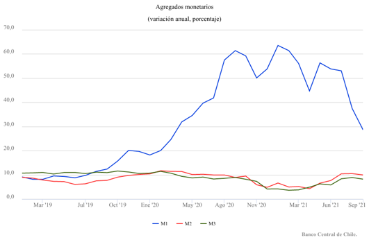
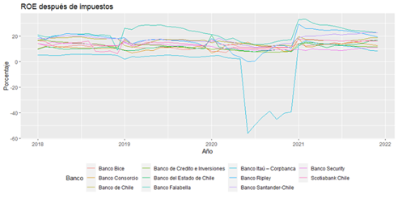
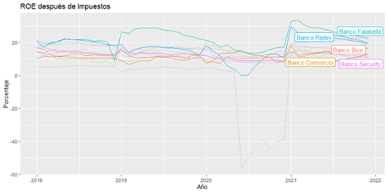
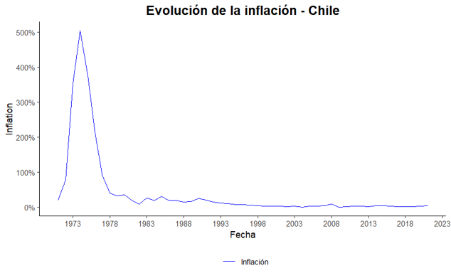
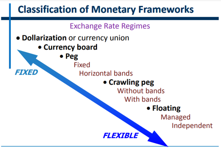
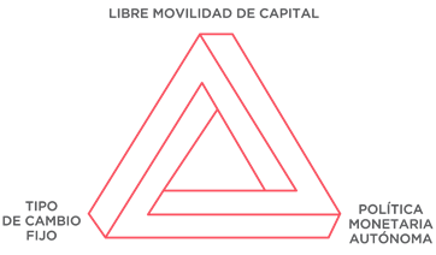

# Presentación del curso

## Equipo docente

**Docentes:**

- Sebastián Egaña Santibáñez
- Felipe Jaque

**Ayudante:**

- Jean Pierre Bravo

------------------------------------------------------------------------

## Sobre el docente

**Sebastián Egaña Santibáñez**

- Analytics Translator — LATAM Airlines
- Correo: [segana@fen.uchile.cl](mailto:segana@fen.uchile.cl)
- Web: <https://segana.netlify.app>
- LinkedIn: [enlace](https://www.linkedin.com/in/sebastian-egana-santibanez/)

------------------------------------------------------------------------

## ¿Qué veremos esta clase?

| Bloque | Conceptos clave |
|---|---|
| Variables Nominales y Reales | Ecuación de Fisher, Regla de Taylor, tasa real |
| Dinero | Definición, agregados monetarios, generación de dinero |
| Política Monetaria | BCCh, TPM, regímenes cambiarios, trinidad imposible |
| Política Fiscal | BCA, institucionalidad, gastos e impuestos |

------------------------------------------------------------------------

## Hilo conductor de la clase

Partimos con un titular. Al terminar la sesión deberían poder leerlo con precisión.

::: {style="font-size: 1.15em; font-weight: bold; color: #0d6e6e; border-left: 6px solid #0d6e6e; padding-left: 1em; margin: 1em 0;"}
"El Banco Central baja la TPM: ¿por qué lo hace y qué pasa con el fisco?"
:::

Para entenderlo necesitamos saber qué es la TPM, cómo la decide el BCCh, cómo se relaciona con la inflación y los precios, y por qué una baja de tasas tiene implicancias para las finanzas públicas.

------------------------------------------------------------------------

# Variables Nominales y Reales

## Ecuación de Fisher y tasas de interés

Sobre el tema visto en la clase pasada, una definición necesaria para esta clase corresponde a la ecuación de Fisher, que en términos simplificados puede definirse como:

$$i = r + \pi^e$$

Donde $i$ corresponde a la tasa nominal de la economía, $r$ corresponde a la tasa real de la economía y $\pi^e$ corresponde a la tasa de inflación esperada.

------------------------------------------------------------------------

## Tasa nominal y Regla de Taylor

Corresponde a la regla de decisión sobre la tasa de la economía por parte de los Bancos Centrales:

$$i_t = r_t^* + \pi_t + \alpha_\pi(\pi_t - \pi_t^*) + \alpha_y(Y_t - Y_t^*)$$

Donde:

| Variable | Descripción |
|---|---|
| $i_t$ | Tasa de interés nominal |
| $r_t^*$ | Tasa real esperada |
| $\pi_t$ | Tasa de inflación actual (Deflactor) |
| $\pi_t^*$ | Tasa de inflación objetivo |
| $\alpha$ | Factores de ajuste |
| $Y_t$ | PIB real |
| $Y_t^*$ | PIB Potencial |

> Lectura de referencia: Taylor Rule — ver `lectura 01 Taylor Rule.pdf`

------------------------------------------------------------------------

## Sobre la tasa de interés

Dentro del análisis económico, existen supuestos en base al tipo de economía analizada y la influencia en sus variables.

En el caso de Chile, se tiende a hablar de una **economía pequeña y abierta**, lo que quiere decir que sus variables internas están influenciadas por las variables de países más grandes.

Esto en relación al tema de la tasa y para una economía con perfecta movilidad de capitales: la tasa nacional viene determinada de manera directa por la tasa de equilibrio internacional, por lo tanto:

$$r = r^*$$

Donde $r^*$ corresponde a la tasa internacional.

------------------------------------------------------------------------

# Dinero

## ¿Qué es el dinero?

El dinero se puede definir como un **activo que es parte de la riqueza financiera de las personas**. Otra forma de definir el dinero es a través de sus funciones:

1. **Medio de pago:** puede ser utilizado en transacciones
2. **Unidad de cuenta:** los precios se expresan en términos de dinero
3. **Depósito de valor:** utilización para acumular activos

Dentro de la economía actual, el dinero puede ser definido como la suma del circulante (billetes y monedas, $C$) y depósitos a la vista ($D_v$):

$$M = C + D_v$$

------------------------------------------------------------------------

## Oferta de dinero

Por lo general el dinero se clasifica según su **grado de liquidez**; a esto refieren los distintos agregados:

- **M1:** compuesto por billetes y monedas en circulación, las cuentas corrientes y cuentas a la vista
- **M2:** M1 más los depósitos a plazo en pesos chilenos
- **M3:** M2 más depósitos en moneda extranjera, así como la tenencia de bonos por parte del sector privado no bancario

El ciclo reciente ilustra cómo la política afecta los agregados: durante 2020–2021 el M1 creció ~60% anual por los retiros de fondos de pensiones. La respuesta del BCCh — subir la TPM desde 0,5% a 11,25% entre 2021 y 2022 — encareció el crédito, frenó la demanda de dinero y llevó M1 de vuelta a tasas de un dígito hacia 2023–2024.

::: {style="font-size: 0.8em; color: #666;"}
Fuente: Banco Central de Chile, Estadísticas Monetarias y Financieras
:::

------------------------------------------------------------------------

## Cantidad de dinero y agregados monetarios

Vemos acá la relación entre inflación y la cantidad de dinero inyectada a la economía. El M1 llegó a crecer un **~60% anual** en 2020–2021 por los retiros de fondos de pensiones y transferencias fiscales — lo que estuvo directamente asociado al peak inflacionario de 2022. Desde 2023, M1 convergió hacia tasas de crecimiento de un dígito.

{fig-align="center" width="80%"}

::: {style="font-size: 0.75em; color: #666;"}
Fuente: Banco Central de Chile — gráfico cubre 2019–2021; ciclo completo incluye normalización 2022–2025
:::

------------------------------------------------------------------------

## Agregados monetarios y rentabilidad de los bancos

:::: {.columns}
::: {.column width="50%"}
{fig-align="center" width="100%"}
:::
::: {.column width="50%"}
{fig-align="center" width="100%"}
:::
::::

------------------------------------------------------------------------

## Proceso de generación de dinero

La emisión de dinero o de la base monetaria es un proceso a cargo del **Banco Central de Chile**. Es quien por ley puede imprimir o mandar a imprimir billetes y monedas de curso legal, que obligadamente deben ser aceptados como medio de pago. Esto se hace a través de la **Casa de La Moneda**.

El proceso secundario es a través de la **tasa de encaje** de la economía. 

------------------------------------------------------------------------

## Proceso de generación de dinero

En Chile, esta tasa fue modificada de manera transitoria el 8 de mayo del 2020:

:::tiny
:::: {.columns}
::: {.column width="50%"}
**Moneda Nacional**

| Tipo de obligación | Tasa |
|---|---|
| Depósitos a la orden judicial (art. 517 COT) | 3,6% |
| Otros depósitos y obligaciones a la vista | 9% |
| Depósitos desde un día plazo y ahorro a plazo | 3,6% |
| Otras captaciones hasta un año plazo | 3,6% |
:::
::: {.column width="50%"}
**Moneda Extranjera**

| Tipo de obligación | Tasa |
|---|---|
| Depósitos y otras obligaciones a la vista | 9% |
| Depósitos desde un día plazo y ahorro a plazo | 3,6% |
| Otras captaciones hasta un año plazo | 3,6% |
| Obligaciones con el exterior hasta un año plazo | 3,6% |
:::
::::
:::

> Ver actividad: `clase02_actividad_02_dinero` · Excel de apoyo: `data/ejercicio 02 generacion dinero.xlsx`

------------------------------------------------------------------------

# Política Monetaria

## Banco Central de Chile

En Chile, el organismo encargado corresponde al **Banco Central**. Sus funciones son:

1. Velar por la estabilidad de la moneda, a través del control de la inflación
2. Promover la estabilidad y eficacia del sistema financiero, velando por la normalidad de los pagos internos y externos

La principal atribución para esto corresponde a la regulación de la **cantidad de dinero en circulación y el crédito en la economía**.

> Más información: [bcentral.cl](https://www.bcentral.cl)

------------------------------------------------------------------------

## Banco Central y política monetaria

En términos de política monetaria, es relevante definir los siguientes elementos:

- **Política Monetaria:** velar por la estabilidad de la moneda, lo que en la práctica se relaciona con el control de la inflación
- **Tasa de política monetaria (TPM):** tasa orientada a cumplir la meta de inflación a dos años; en la práctica, es la tasa que determina el nivel de tasa de préstamos interbancarios diaria
- **Meta inflacionaria:** la meta para Chile corresponde a un **3%** en un plazo de dos años
- **Flotación cambiaria:** el tipo de cambio nominal es determinado por el mercado, en la interacción entre oferta y demanda de divisas

------------------------------------------------------------------------

## Inflación y autonomía

{fig-align="center" width="70%"}

Uno de los principios claves del Banco Central corresponde a su **autonomía**, que principalmente ha influido en la estabilización de la inflación. La autonomía, en términos simples, nos habla de la no influencia del gobierno en sus decisiones.

------------------------------------------------------------------------

## Inflación y autonomía

La historia inflacionaria de Chile muestra con claridad el efecto de este principio: desde un peak de más de 500% anual en los años 70, la inflación se estabilizó bajo el 10% desde mediados de los 90. El ciclo reciente confirma la capacidad de reacción del BCCh:

:::tiny
| Año | IPC anual | Hito |
|---|---|---|
| 2021 | 7,2% | Retiros AFP + gasto fiscal pandemia |
| 2022 | **~13,7%** | Peak: agosto 2022 llegó a ~14,1% |
| 2023 | 3,9% | Ciclo de alza TPM (hasta 11,25%) surte efecto |
| 2024 | ~4,5% | Convergencia gradual |
| Feb 2025 | ~3,0% | De vuelta en la meta |
:::

::: {style="font-size: 0.75em; color: #666;"}
Fuente: INE Chile / BCCh — gráfico cubre hasta 2023; ciclo 2021–2025 no incluido visualmente
:::

------------------------------------------------------------------------

## Reunión de política monetaria

Corresponde a la instancia de decisión en que el **Consejo del Banco Central** decide los cambios en la TPM. Se realizan **8 reuniones al año**. Cuatro de estas coinciden con el día hábil previo a la publicación del IPoM.

Sobre la divulgación: el consejo redacta un comunicado que se publica a las 18 horas del mismo día de la RPM y **11 días hábiles después** se publica la Minuta de la reunión.

> Ver calendario de RPM en [bcentral.cl](https://www.bcentral.cl)

------------------------------------------------------------------------

## Regímenes cambiarios

Los sistemas existentes van desde el tipo de cambio fijo hasta la flotación pura:

:::tiny
:::: {.columns}
::: {.column width="50%"}
{fig-align="center" width="100%"}
:::
::: {.column width="50%"}
- **Currency board:** organización gubernamental que controla el tipo de cambio fijo
- **Peg + fixed:** tipo de cambio fijo
- **Peg + horizontal bands:** tipo de cambio fijo con bandas
- **Crawling peg:** paridad móvil
- **Floating managed:** flotación con intervenciones
- **Floating independent:** determinado por el mercado
:::
::::
:::
------------------------------------------------------------------------

## Dilemas de política económica: trinidad imposible

Un país **no puede mantener simultáneamente** las tres siguientes condiciones:

:::: {.columns}
::: {.column width="45%"}
{fig-align="center" width="100%"}
:::
::: {.column width="55%"}
1. **Libre movilidad de capitales**
2. **Tipo de cambio fijo**
3. **Política monetaria autónoma**

Solo se pueden elegir **dos de las tres**.
:::
::::

------------------------------------------------------------------------

## Dilemas de política económica: trinidad imposible

:::tiny
:::: {.columns}
::: {.column width="33%"}
**China (2000–2015):**

- Tipo de cambio semi-fijo
- Política monetaria activa (BPC)
- Controles de capital estrictos

Renunció a la **libre movilidad de capitales**.
:::
::: {.column width="33%"}
**Chile (2000–hoy):**

- Movilidad total de capitales
- Política monetaria autónoma (BCCh)
- Tipo de cambio flexible

Renunció al **tipo de cambio fijo**.
:::
::: {.column width="33%"}
**Argentina (2019–2023):**

- Cepo cambiario (restricción de capitales)
- Tipo de cambio oficial fijo
- Política monetaria activa (BCRA)

Renunció a la **libre movilidad de capitales**
:::
::::
:::

------------------------------------------------------------------------

## Balanza de pagos

El régimen cambiario de un país determina cómo se ajusta el tipo de cambio ante desequilibrios externos. La **balanza de pagos** es el registro contable de esos flujos: su saldo es lo que genera la oferta y demanda de divisas que mueve el tipo de cambio en un régimen de flotación como el de Chile.

Se define como el documento contable que registra de forma sistemática todas las transacciones que efectúan los residentes de un país y los residentes del extranjero durante un período determinado.

------------------------------------------------------------------------

## Balanza de pagos

**Cuenta corriente** — operaciones relacionadas con la generación de renta corriente:

:::tiny
- **Balanza comercial:** operaciones de compraventa de bienes
- **Balanza de servicios:** operaciones de compraventa de servicios
- **Balanza de rentas:** pagos a los factores de producción (intereses, dividendos, salarios en el extranjero)
- **Balanza de transferencias corrientes:** transferencias sin contrapartida (remesas, donaciones)
:::

**Cuenta de capital:** transferencias de capital y compraventa de activos no producidos (derechos de autor, marcas).

**Cuenta financiera:** operaciones que implican variación de activos o pasivos financieros (IDE, inversiones en cartera).


------------------------------------------------------------------------

------------------------------------------------------------------------

# Política Fiscal

## Gastos e impuestos

En el caso del gobierno, tenemos la siguiente ecuación:

$$DF_t = G_t + i \cdot B_t - T_t$$

Donde:

- $DF_t$: déficit fiscal
- $G_t$: gasto total de gobierno (gasto corriente en transferencias + gasto en capital/inversión)
- $T_t$: ingresos, principalmente tributarios
- $B_t$: deuda neta

**Pregunta:** ¿Qué otro tipo de ingreso tiene el Gobierno? Piense en EE.UU.

------------------------------------------------------------------------

## Formación bruta de capital fijo

Dentro del gasto de gobierno ($G_t$), el componente de **inversión pública** se mide a través de la formación bruta de capital fijo — un indicador clave de la política fiscal de largo plazo.

:::tiny
**Definición:** comprende los gastos que adicionan bienes nuevos duraderos a las existencias de activos fijos, menos sus ventas netas de bienes similares de segunda mano y de desecho, efectuadas por las industrias, las administraciones públicas y los servicios privados no lucrativos.

**¿Qué mide?** Construcción y otras obras, maquinaria y equipo. Excluye objetos valiosos, software de autoconsumo y obras literarias o artísticas.

En el caso de ser **bruta**, refiere al no descuento de la depreciación.
:::

> Ver IPoM más reciente en [bcentral.cl](https://www.bcentral.cl)

------------------------------------------------------------------------

## Institucionalidad asociada

- **Ministerio de Hacienda:** gestionar eficientemente los recursos públicos a través de un Estado moderno, generando condiciones de estabilidad, transparencia y competitividad
- **DIPRES (Dirección de Presupuestos):** organismo técnico encargado de velar por la asignación y uso eficiente de los recursos públicos mediante la aplicación de sistemas de gestión financiera
- **Comité Consultivo del Precio de Referencia del Cobre:** define el precio del cobre para los próximos 10 años
- **Comité Consultivo del PIB Tendencial:** define el PIB tendencial
- **Consejo Fiscal Autónomo (CFA):** asesora al Ministerio de Hacienda en temas fiscales, revisa los cálculos y evalúa propuestas para modificación de reglas

------------------------------------------------------------------------

## Balance cíclicamente ajustado

Se intenta generar un grado de credibilidad para la política fiscal, con la intención de evitar un **gasto cíclico**.

En particular:

- No amplificar el ciclo económico
- Evitar el crecimiento irreversible del tamaño del Estado durante los auges
- Costos sociales y de eficiencia de cortar gastos públicos; por otro lado, mejora la coordinación con la política monetaria
- Reduce presiones sobre el tipo de cambio al aminorar movimientos de las tasas de interés

------------------------------------------------------------------------

## ¿En qué consiste actualmente el BCA?

:::tiny
> "Esto significa que, cumpliendo esta regla, el balance efectivo será menor a 0% del PIB cuando las condiciones cíclicas sean desfavorables y superior a 0% del PIB cuando las condiciones cíclicas sean favorables al presupuesto fiscal."

**¿Cómo se calcula?**

| Cálculo del BCA |
|---|
| Ingresos Cíclicamente Ajustados (Ajuste por PIB Tendencial, precio de referencia del cobre, etc.) |
| (−) Gasto Público (Presupuesto) |
| **Balance Cíclicamente Ajustado** (Meta Fiscal determinada por la autoridad) |
:::

> Más información en [dipres.gob.cl](https://www.dipres.gob.cl)

------------------------------------------------------------------------

## Elementos importantes

- **Definición de la meta:** por parte del Gobierno
- **Determinación de parámetros estructurales:** PIB Tendencial y precio del cobre de referencia en base a proyección de expertos independientes
- **Proyección de ingresos efectivos** en base a variables macroeconómicas proyectadas — papel del Ministerio de Hacienda y la DIPRES
- **Determinación del nivel de gasto público** por diferencia

:::tiny
Se intenta evitar la influencia de los ciclos dentro del gasto de gobierno. Un factor relevante dentro de los ingresos fiscales son los impuestos, los que por lo general son **procíclicos**. Por lo tanto, dicha metodología intenta excluir el ciclo ya sea positivo o negativo, y con esto en años de mayor crecimiento los ingresos adicionales se ahorran y en años de menor crecimiento se recurre a dichos ahorros para no ajustar el gasto público.
:::

------------------------------------------------------------------------

# Cierre

## Volvamos al titular {.smaller}

::: {style="font-size: 1.1em; font-weight: bold; color: #0d6e6e; border-left: 6px solid #0d6e6e; padding-left: 1em; margin: 1em 0;"}
"El Banco Central baja la TPM: ¿por qué lo hace y qué pasa con el fisco?"
:::

Ahora pueden leer esto con precisión:

- **"Banco Central baja la TPM"**: el Consejo del BCCh decide en la RPM reducir la tasa de política monetaria porque la inflación está convergiendo a la meta del 3% — la Regla de Taylor lo anticipa cuando $\pi_t \to \pi_t^*$ y $Y_t \approx Y_t^*$
- **"¿Por qué lo hace?"**: según la ecuación de Fisher, una TPM más baja reduce $i$, lo que abarata el crédito, estimula el consumo e inversión.
- **"¿Qué pasa con el fisco?"**: con tasas más bajas el costo de la deuda soberana ($i \cdot B_t$) disminuye, lo que mejora el déficit fiscal ($DF_t = G_t + i \cdot B_t - T_t$). El BCA evita que este alivio se traduzca en mayor gasto cíclico

------------------------------------------------------------------------

## Lo que conecta todo

```
TPM baja  →  tasa nominal baja (Fisher: i = r + πᵉ)
                    ↓
      crédito más barato → consumo e inversión suben
                    ↓
         tipo de cambio se deprecia levemente
                    ↓
      costo de deuda soberana cae (i · Bₜ menor)
                    ↓
   BCA evita que el alivio fiscal amplifique el ciclo
```

> El Banco Central y el fisco no operan en silos — sus decisiones se retroalimentan a través de la tasa de interés.

------------------------------------------------------------------------

## Fechas relevantes

| Actividad | Detalle |
|---|---|
| Clase 1 | Generación de grupos |
| Clase 2 | Caso formativo |
| Clase 3 | — |
| Clase 4 | Caso sumativo |

------------------------------------------------------------------------

## Fuentes y referencias {.smaller}

- Banco Central de Chile. (2026). *Informe de Política Monetaria*. [bcentral.cl](https://www.bcentral.cl)
- Dirección de Presupuestos. *Balance Cíclicamente Ajustado*. [dipres.gob.cl](https://www.dipres.gob.cl)
- Taylor, J. B. (1993). Discretion versus policy rules in practice. *Carnegie-Rochester Conference Series on Public Policy*, 39, 195–214.
